# GEO 系统全景展示

> GEO 系统持续测量品牌在生成式 AI 中的可见性、信源引用和内容传播效果。系统把客户授权范围转化为可执行任务，从模型 API、消费级 AI 真实网页和真实 App 三种表面采集回答，再生成可追溯证据、五项专业分析结果和正式交付物。

> **版本快照**
>
> - 记录时间：2026-08-25T13:07:27+08:00（Asia/Shanghai）。
> - 主实现仓库：<code>platform-v2</code>，分支 <code>master</code>，提交 <code>c6f53153f4a9ac44490850c74ef7124b05ac2916</code>。
> - 对应提交时间：2026-08-25T12:13:37+08:00。
> - 开发态工作树：包含 94 个 Git 状态项。本文对应提交锚点及其尚未提交的开发态内容。
> - 已跟踪改动指纹：SHA-256 <code>0570ace0e9bdd84977fc85abfc00e43659b26f7a1e5ea36beecbb69c4d57deba</code>。

## 展示口径

- **规模数据**采用 2026-08-24 生产审计快照。
- **当前开发结构**采用 2026-08-25 静态盘点。
- **状态标记**只描述实现成熟度，主要使用【已上线】、【已实跑】、【部分完成】、【分阶段建设】、【待接入】和【待实现】。
- **颜色含义**：绿色表示客户，橙色表示运营/分析/审核人员，深紫表示 Agent Skill，浅紫表示产品内运行时 AI，蓝色表示确定性软件，灰色表示外部系统，青色表示事实、证据和交付物，藏蓝表示架构分层标题。
- **模块口径**：生产审计识别 24 个业务功能模块，当前开发工作树盘点到 25 个 API 模块目录；下文按展示关系归并为 16 个能力模块，并保留全部实现范围。

## 系统规模速览

| 规模维度                          |               审计快照 |
| --------------------------------- | ---------------------: |
| 角色化 Web 工作台                 |                   5 个 |
| 业务模块                          |                  24 个 |
| API 路径 / 操作 / Schema          |        262 / 320 / 395 |
| 生产业务表 / 数据域               |                173 / 9 |
| Workflow / Activity / Worker 入口 |             8 / 33 / 6 |
| 一方源文件 / 源代码               |       994 / 356,550 行 |
| 测试文件 / 测试代码               |       318 / 109,113 行 |
| 采集任务 / 回答与分析             |          3,104 / 1,492 |
| 引用事实 / 证据资产               |        13,007 / 21,781 |
| 规范 URL / Occurrence / 页面快照  | 4,853 / 11,010 / 3,141 |

---

## 核心图一｜开发者视角：部署、安全域与运行组件（对应 02 #2）

这组图展示系统的运行边界。分层总览适合快速定位系统结构；关系展开版把工作台、边缘入口、授权步骤、业务域、事件、Worker、采集资源、外部表面和存储分别画成节点，并用带语义的连线展示组件内关系与跨层关系。

### 分层总览

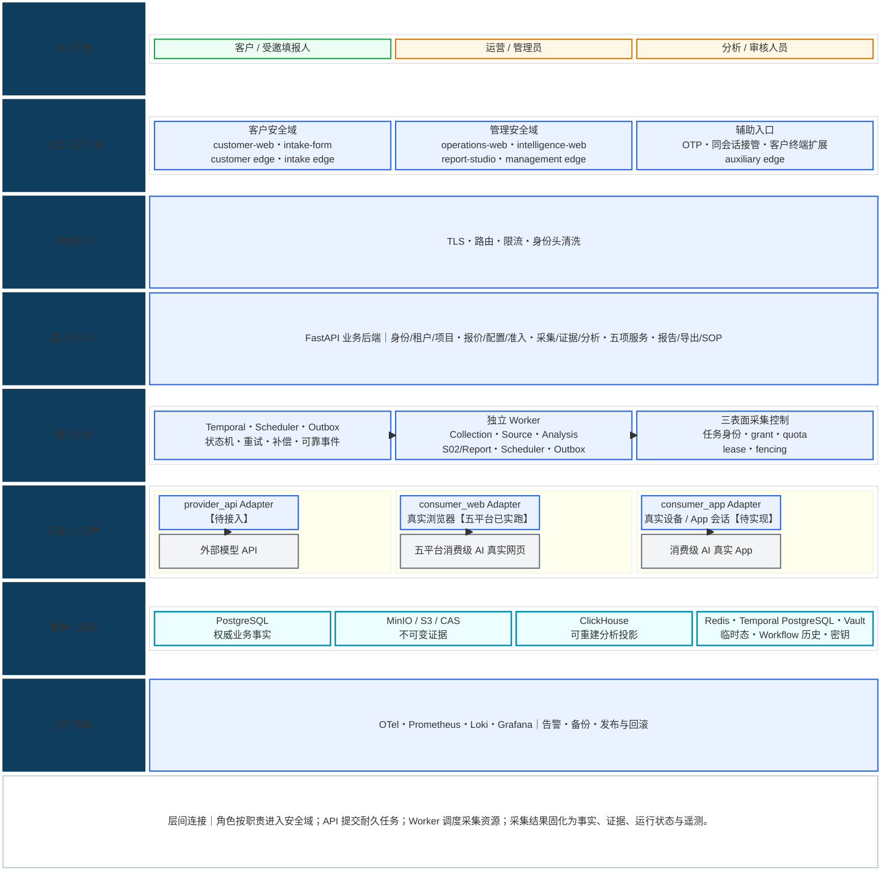

### 关系展开版｜组件、调用、事件与数据流

关系展开版由 1A—1E 五个分面和一个可展开的全连接索引组成。五个分面依次放大入口与安全、业务域、任务执行、AI 与人工批准、数据与运行保障；同名节点始终保持同一含义，1F 再把关键跨层关系合并到一个画布。流程图中的实线表示调用、控制或任务路由，虚线表示依赖、异步事件、状态约束或人工接管，粗线表示需要持久化的事实、证据、命令或投影；时序图中的实线和虚线分别表示请求与返回。每个节点只表达一个组件或一项明确职责，节点内换行只补充实现名、责任或当前状态。

#### 1A｜角色如何穿过安全域到达 FastAPI

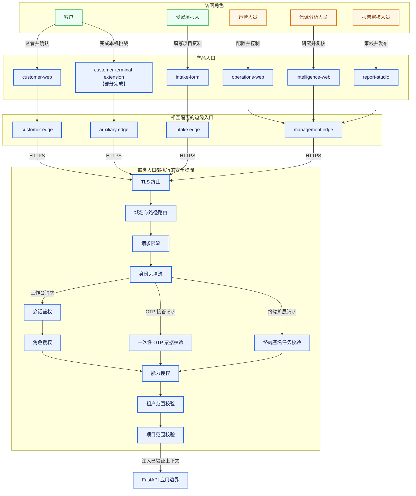

##### 七个共享前端包的真实直接依赖

箭头表示当前 <code>package.json</code> 中的直接 workspace 依赖。<code>domain-types</code> 目录存在，静态盘点未发现当前应用或其他共享包直接引用它。

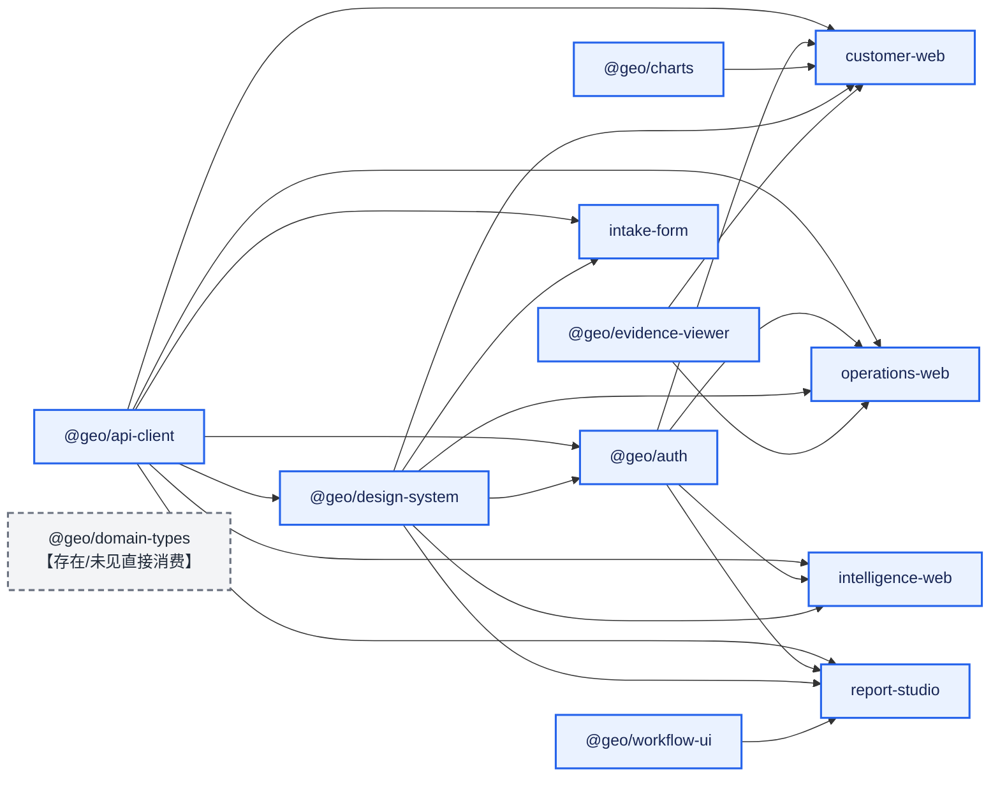

#### 1B｜后端业务域如何传递事实

图中的 25 个具名节点对应当前后端顶层模块目录，另有一个跨模块准入职责。路由模块由 FastAPI 挂载；<code>tenancy</code> 提供共享租户能力；<code>notifications</code> 同时包含独立部署的通知 Bot。它们通过同一后端代码库、数据库事实和事件协作。

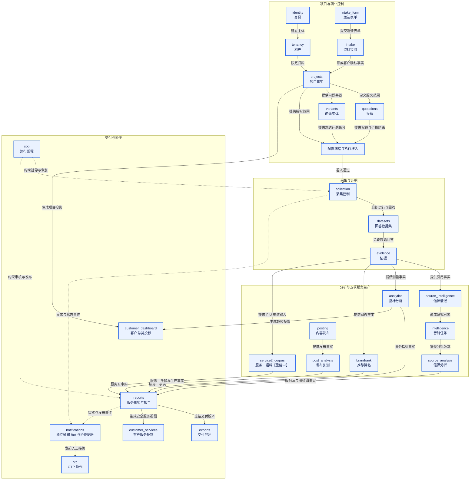

#### 1C｜业务命令如何变成三表面真实执行

##### 命令派发与表面调用

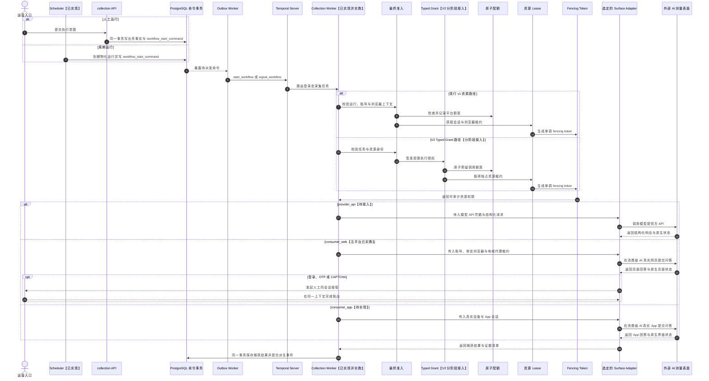

##### 捕获完成后的并行事实生产

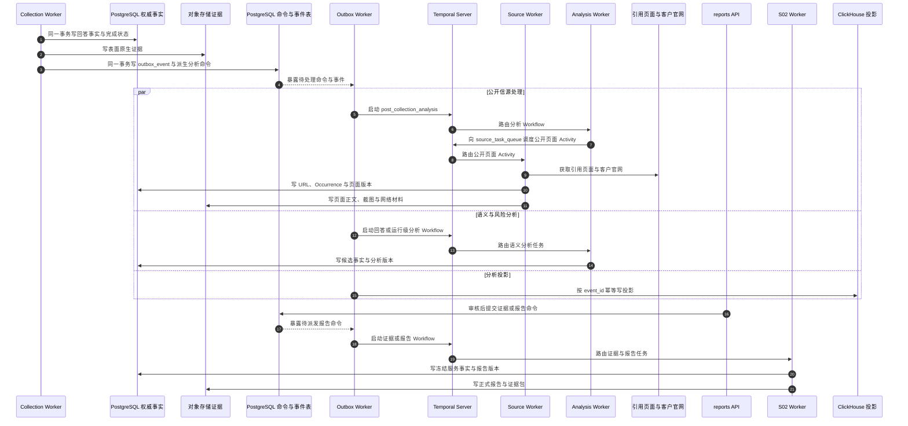

##### consumer_web 五个平台适配器展开

五个平台适配器拥有独立的 DOM、成功判定、模式识别和错误语义；资源治理先绑定账号、常驻浏览器、地域代理和 fencing 权限，再把同一个受控执行上下文交给选中的平台适配器。

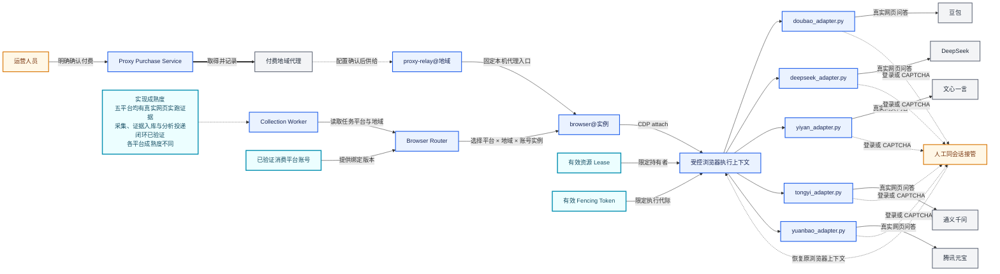

<details>
<summary>展开组件拓扑图</summary>

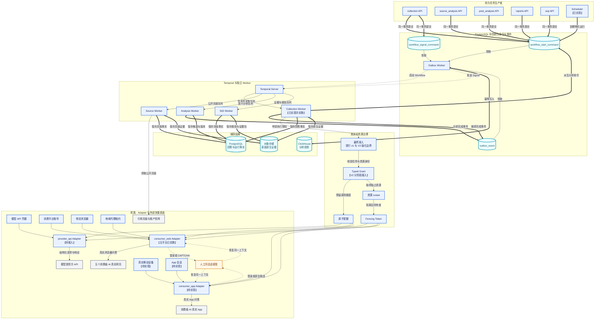

</details>

#### 1D｜运营侧 Agent Skill、产品内运行时 AI 与人工批准

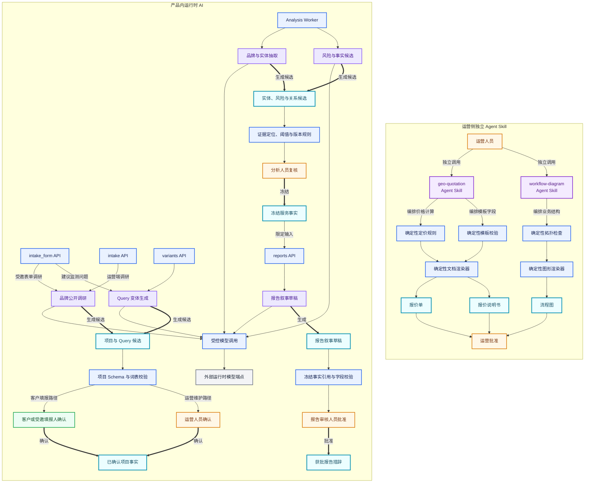

#### 1E｜运行组件如何读写数据并形成监控、备份与发布闭环

##### 数据职责

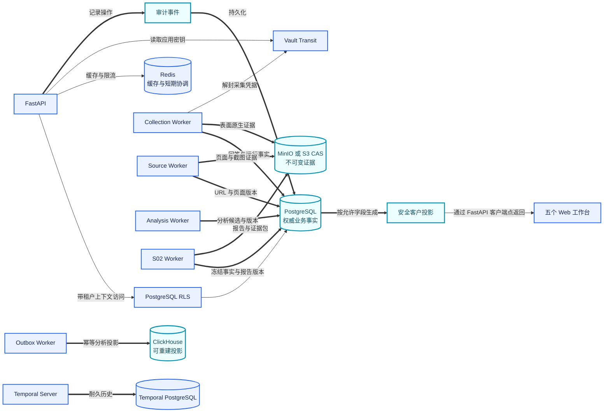

##### 监控、备份与发布闭环

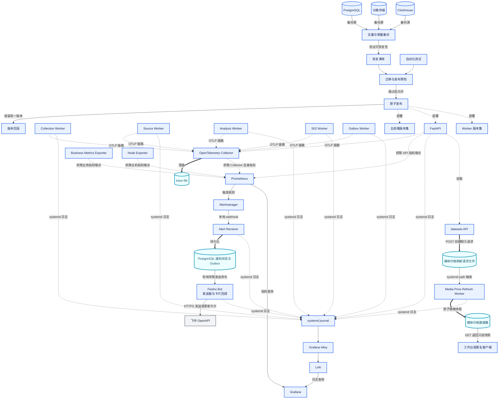

<details>
<summary>展开逐运行组件的完整连线图</summary>

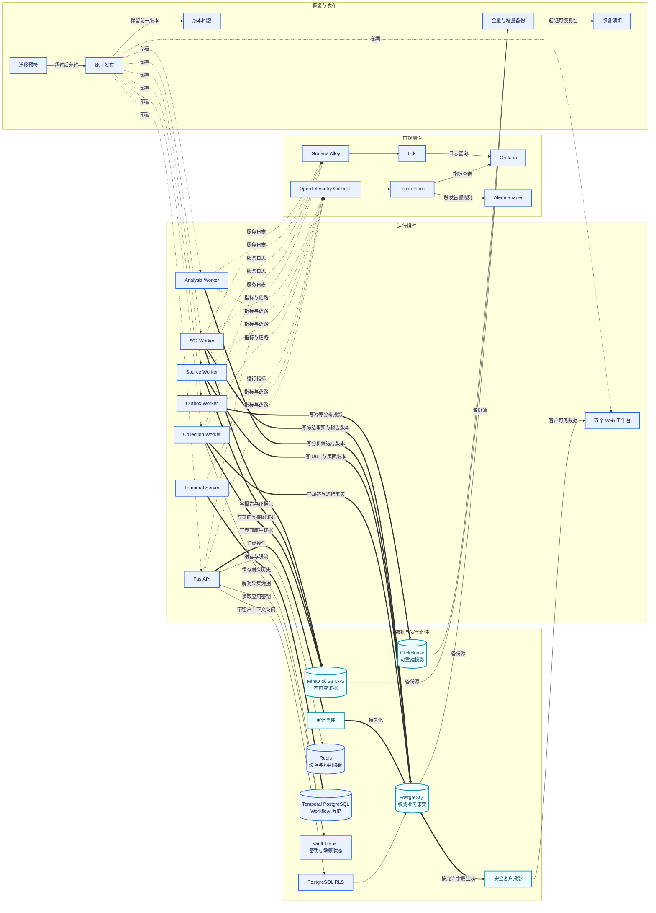

</details>

#### 1F｜全连接索引图（适合放大后做开发审计）

<details>
<summary>展开全连接索引图</summary>

这张索引图把五个分面的同名节点合并到一个画布，适合搜索遗漏关系和做架构审计；展示讲解优先使用 1A—1E。

```mermaid
flowchart TB
    subgraph L1["A. 访问角色、产品入口与独立 Agent Skill"]
        direction LR
        CUSTOMER["客户"]
        INVITEE["受邀填报人"]
        OPERATOR["运营人员"]
        ANALYST["信源分析人员"]
        REVIEWER["报告审核人员"]

        CUSTOMER_WEB["customer-web"]
        INTAKE_FORM["intake-form"]
        OPERATIONS_WEB["operations-web"]
        INTELLIGENCE_WEB["intelligence-web"]
        REPORT_STUDIO["report-studio"]
        TERMINAL_EXT["customer-terminal-extension<br/>辅助挑战确认【部分完成】"]
        FRONTEND_PACKAGES["共享前端 packages"]

        QUOTATION_SKILL["geo-quotation<br/>Agent Skill"]
        DIAGRAM_SKILL["workflow-diagram<br/>Agent Skill"]
        PRICING_TOOL["确定性定价规则工具"]
        DOCUMENT_TOOL["确定性文档渲染工具"]
        DIAGRAM_TOOL["确定性图表校验工具"]
        QUOTATION_DOC["报价单"]
        EXPLANATION_DOC["报价说明书"]
        FLOW_DOC["流程图"]
        OPS_APPROVAL["运营批准"]

        CUSTOMER -->|查看结果并确认项目事实| CUSTOMER_WEB
        CUSTOMER -->|在本机完成原生挑战| TERMINAL_EXT
        INVITEE -->|填写品牌与项目资料| INTAKE_FORM
        OPERATOR -->|配置并控制业务| OPERATIONS_WEB
        ANALYST -->|研究并复核信源| INTELLIGENCE_WEB
        REVIEWER -->|审核并发布报告| REPORT_STUDIO

        FRONTEND_PACKAGES -.->|复用认证契约| CUSTOMER_WEB
        FRONTEND_PACKAGES -.->|复用表单组件| INTAKE_FORM
        FRONTEND_PACKAGES -.->|复用工作流组件| OPERATIONS_WEB
        FRONTEND_PACKAGES -.->|复用证据查看器| INTELLIGENCE_WEB
        FRONTEND_PACKAGES -.->|复用领域类型| REPORT_STUDIO

        OPERATOR -->|独立调用| QUOTATION_SKILL
        OPERATOR -->|独立调用| DIAGRAM_SKILL
        QUOTATION_SKILL -->|编排价格计算| PRICING_TOOL
        QUOTATION_SKILL -->|编排内容与版式| DOCUMENT_TOOL
        DIAGRAM_SKILL -->|编排结构与图形| DIAGRAM_TOOL
        PRICING_TOOL --> QUOTATION_DOC
        DOCUMENT_TOOL --> QUOTATION_DOC
        DOCUMENT_TOOL --> EXPLANATION_DOC
        DIAGRAM_TOOL --> FLOW_DOC
        QUOTATION_DOC --> OPS_APPROVAL
        EXPLANATION_DOC --> OPS_APPROVAL
        FLOW_DOC --> OPS_APPROVAL
    end

    subgraph L2["B. 四类边缘入口与逐级授权"]
        direction LR
        CUSTOMER_EDGE["customer edge"]
        INTAKE_EDGE["intake edge"]
        MANAGEMENT_EDGE["management edge"]
        AUXILIARY_EDGE["auxiliary edge"]

        TLS["TLS 终止"]
        ROUTER["域名与路径路由"]
        RATE_LIMIT["请求限流"]
        HEADER_CLEAN["身份头清洗"]
        SESSION_AUTH["会话鉴权"]
        SIGNED_TASK_AUTH["一次性票据与签名任务校验"]
        RBAC["角色授权"]
        CAPABILITY["能力授权"]
        PROJECT_SCOPE["租户与项目范围校验"]
        API_APP["FastAPI 应用边界"]

        CUSTOMER_WEB --> CUSTOMER_EDGE
        INTAKE_FORM --> INTAKE_EDGE
        OPERATIONS_WEB --> MANAGEMENT_EDGE
        INTELLIGENCE_WEB --> MANAGEMENT_EDGE
        REPORT_STUDIO --> MANAGEMENT_EDGE
        TERMINAL_EXT --> AUXILIARY_EDGE

        CUSTOMER_EDGE -->|HTTPS 请求| TLS
        INTAKE_EDGE -->|HTTPS 请求| TLS
        MANAGEMENT_EDGE -->|HTTPS 请求| TLS
        AUXILIARY_EDGE -->|HTTPS 请求| TLS
        TLS --> ROUTER
        ROUTER --> RATE_LIMIT
        RATE_LIMIT --> HEADER_CLEAN
        HEADER_CLEAN -->|常规工作台请求| SESSION_AUTH
        HEADER_CLEAN -->|辅助接管请求| SIGNED_TASK_AUTH
        SESSION_AUTH --> RBAC
        RBAC --> CAPABILITY
        SIGNED_TASK_AUTH --> CAPABILITY
        CAPABILITY --> PROJECT_SCOPE
        PROJECT_SCOPE -->|携带已验证上下文| API_APP
    end

    subgraph L3["C. FastAPI 模块化单体中的业务域关系"]
        direction LR
        IDENTITY["身份域<br/>identity"]
        TENANCY["租户域<br/>tenancy"]
        INTAKE_FORM_API["邀请表单域<br/>intake_form"]
        INTAKE["资料接收域<br/>intake"]
        PROJECTS["项目事实域<br/>projects"]
        QUOTATIONS["报价域<br/>quotations"]
        VARIANTS["问题变体域<br/>variants"]
        ADMISSION["配置冻结与执行准入"]
        COLLECTION["采集控制域<br/>collection"]
        DATASETS["数据集域<br/>datasets"]
        EVIDENCE["证据域<br/>evidence"]
        SOURCE_INTEL["信源情报域<br/>source_intelligence"]
        INTELLIGENCE["智能任务域<br/>intelligence"]
        SOURCE_ANALYSIS["信源分析域<br/>source_analysis"]
        ANALYTICS["指标分析域<br/>analytics"]
        BRANDRANK["推荐排名域<br/>brandrank"]
        SERVICE2_CORPUS["服务二语料域<br/>重建中"]
        POSTING["内容发布域<br/>posting"]
        POST_ANALYSIS["发布复测域<br/>post_analysis"]
        REPORTS["服务事实与报告域<br/>reports"]
        EXPORTS["交付导出域<br/>exports"]
        CUSTOMER_SERVICES["客户服务投影<br/>customer_services"]
        CUSTOMER_DASHBOARD["客户总览投影<br/>customer_dashboard"]
        NOTIFICATIONS["通知与接管协作<br/>notifications<br/>含独立 Feishu Bot"]
        OTP["OTP 协作域<br/>otp"]
        SOP["运行规程域<br/>sop"]

        API_APP -.->|挂载 Router| IDENTITY
        API_APP -.->|挂载 Router| INTAKE_FORM_API
        API_APP -.->|挂载 Router| INTAKE
        API_APP -.->|挂载 Router| PROJECTS
        API_APP -.->|挂载 Router| QUOTATIONS
        API_APP -.->|挂载 Router| COLLECTION
        API_APP -.->|挂载 Router| EVIDENCE
        API_APP -.->|挂载 Router| ANALYTICS
        API_APP -.->|挂载 Router| REPORTS
        API_APP -.->|挂载 Router| CUSTOMER_SERVICES
        API_APP -.->|挂载 Router| SOP

        CUSTOMER_WEB -.->|授权后调用| CUSTOMER_DASHBOARD
        CUSTOMER_WEB -.->|授权后调用| CUSTOMER_SERVICES
        CUSTOMER_WEB -.->|授权后读取| EVIDENCE
        INTAKE_FORM -.->|邀请票据访问| INTAKE_FORM_API
        INTAKE_FORM_API -->|提交确认内容| INTAKE
        OPERATIONS_WEB -.->|授权后控制| COLLECTION
        OPERATIONS_WEB -.->|授权后管理| QUOTATIONS
        INTELLIGENCE_WEB -.->|授权后研究| SOURCE_INTEL
        INTELLIGENCE_WEB -.->|授权后复核| SOURCE_ANALYSIS
        REPORT_STUDIO -.->|授权后审核| REPORTS

        IDENTITY -->|建立主体| TENANCY
        TENANCY -->|限定归属| PROJECTS
        INTAKE -->|形成客户确认事实| PROJECTS
        PROJECTS -->|定义服务范围| QUOTATIONS
        PROJECTS -->|提供问题基线| VARIANTS
        QUOTATIONS -->|提供权益与价格约束| ADMISSION
        VARIANTS -->|提供冻结问题集合| ADMISSION
        PROJECTS -->|提供授权范围| ADMISSION
        ADMISSION -->|准入通过| COLLECTION
        COLLECTION -->|组织回答与运行批次| DATASETS
        DATASETS -->|关联原始回答| EVIDENCE
        EVIDENCE -->|提供引用事实| SOURCE_INTEL
        SOURCE_INTEL -->|形成研究对象| INTELLIGENCE
        INTELLIGENCE -->|提交分析版本| SOURCE_ANALYSIS
        EVIDENCE -->|提供测量事实| ANALYTICS
        EVIDENCE -->|提供回答样本| BRANDRANK
        EVIDENCE -->|提供全 U 重建输入| SERVICE2_CORPUS
        POSTING -->|提供发布事实| POST_ANALYSIS
        ANALYTICS -->|提供指标事实| REPORTS
        BRANDRANK -->|提供服务一事实| REPORTS
        SERVICE2_CORPUS -->|提供服务二迁移与生产事实| REPORTS
        SOURCE_ANALYSIS -->|提供服务三与服务四事实| REPORTS
        POST_ANALYSIS -->|提供服务五事实| REPORTS
        REPORTS -->|冻结交付版本| EXPORTS
        REPORTS -->|生成安全服务视图| CUSTOMER_SERVICES
        ANALYTICS -->|生成趋势投影| CUSTOMER_DASHBOARD
        PROJECTS -->|生成项目投影| CUSTOMER_DASHBOARD
        COLLECTION -.->|异常与状态事件| NOTIFICATIONS
        REPORTS -.->|审核与发布事件| NOTIFICATIONS
        NOTIFICATIONS -.->|发起人工接管| OTP
        SOP -.->|约束暂停与恢复| COLLECTION
        SOP -.->|约束审核与发布| REPORTS
    end

    subgraph L4["D. 耐久命令、Temporal 与独立 Worker"]
        direction LR
        START_COMMAND[("workflow_start_command")]
        SIGNAL_COMMAND[("workflow_signal_command")]
        EVENT_OUTBOX[("outbox_event")]
        SCHEDULER["Scheduler<br/>【已实现】"]
        OUTBOX_WORKER["Outbox Worker<br/>命令派发与分析投影"]
        TEMPORAL["Temporal Server"]
        COLLECTION_WORKER["Collection Worker<br/>登录态采集【已实现并实跑】"]
        SOURCE_WORKER["Source Worker<br/>公开页面采集"]
        ANALYSIS_WORKER["Analysis Worker<br/>语义与风险分析"]
        S02_WORKER["S02 Worker<br/>证据与报告生产"]

        COLLECTION ==>|同一事务提交启动命令| START_COMMAND
        SOURCE_ANALYSIS ==>|同一事务提交分析命令| START_COMMAND
        POST_ANALYSIS ==>|同一事务提交复测命令| START_COMMAND
        REPORTS ==>|同一事务提交报告命令| START_COMMAND
        SOP ==>|同一事务提交规程任务| START_COMMAND
        COLLECTION ==>|同一事务提交控制命令| SIGNAL_COMMAND
        SCHEDULER ==>|到期物化运行| START_COMMAND
        START_COMMAND -->|领取待派发命令| OUTBOX_WORKER
        SIGNAL_COMMAND -->|领取待派发命令| OUTBOX_WORKER
        EVENT_OUTBOX -->|领取待投影事件| OUTBOX_WORKER
        OUTBOX_WORKER -.->|启动 Workflow| TEMPORAL
        OUTBOX_WORKER -.->|发送 Signal| TEMPORAL
        TEMPORAL -->|登录态采集队列| COLLECTION_WORKER
        TEMPORAL -->|公开页面队列| SOURCE_WORKER
        TEMPORAL -->|分析队列| ANALYSIS_WORKER
        TEMPORAL -->|证据与报告队列| S02_WORKER
        COLLECTION_WORKER ==>|保存捕获事件| EVENT_OUTBOX
        ANALYSIS_WORKER ==>|保存分析事件| EVENT_OUTBOX
        COLLECTION_WORKER ==>|提交回答分析命令| START_COMMAND
        COLLECTION_WORKER ==>|提交运行级分析命令| START_COMMAND
    end

    subgraph L5["E. 运行时 AI、资源治理与三类外部测量表面"]
        direction LR
        RESEARCH_AI["品牌公开调研<br/>产品内运行时 AI"]
        QUERY_AI["Query 变体生成<br/>产品内运行时 AI"]
        EXTRACTION_AI["品牌与实体抽取<br/>产品内运行时 AI"]
        RISK_AI["风险与事实候选<br/>产品内运行时 AI"]
        REPORT_AI["报告叙事草稿<br/>产品内运行时 AI"]
        RUNTIME_MODEL["外部运行时模型端点"]

        FINAL_ADMISSION["发送前最终准入"]
        V1_RESOURCE_GATE["v1 账号、会话与浏览器校验<br/>【现行路径】"]
        TYPED_GRANT["Typed Grant<br/>【V2 分阶段接入】"]
        QUOTA["原子配额"]
        LEASE["资源 Lease"]
        FENCING["Fencing Token"]

        API_CREDENTIAL["模型 API 凭据"]
        PLATFORM_ACCOUNT["消费平台账号"]
        RESIDENT_BROWSER["常驻浏览器"]
        REGION_PROXY["地域代理租约"]
        APP_DEVICE["真实移动设备<br/>【待实现】"]
        APP_SESSION["App 会话<br/>【待实现】"]

        PROVIDER_ADAPTER["provider_api Adapter<br/>【待接入】"]
        WEB_ADAPTER["consumer_web Adapter<br/>【五平台已实跑】"]
        APP_ADAPTER["consumer_app Adapter<br/>【待实现】"]
        MODEL_API["模型提供方 API"]
        CONSUMER_WEB["五个消费级 AI 真实网页"]
        CONSUMER_APP["消费级 AI 真实 App"]
        PUBLIC_PAGE["被引用页面与客户官网"]
        MEDIA_PROVIDER["媒体与内容供应商"]
        HUMAN_TAKEOVER["人工同会话接管"]

        INTAKE_FORM_API -.->|请求表单预填候选| RESEARCH_AI
        INTAKE_FORM_API -.->|请求监测问题建议| QUERY_AI
        INTAKE -.->|请求运营端预填候选| RESEARCH_AI
        VARIANTS -.->|请求问题候选| QUERY_AI
        ANALYSIS_WORKER -.->|请求语义候选| EXTRACTION_AI
        ANALYSIS_WORKER -.->|请求审核候选| RISK_AI
        REPORTS -.->|请求受约束草稿| REPORT_AI
        RESEARCH_AI --> RUNTIME_MODEL
        QUERY_AI --> RUNTIME_MODEL
        EXTRACTION_AI --> RUNTIME_MODEL
        RISK_AI --> RUNTIME_MODEL
        REPORT_AI --> RUNTIME_MODEL

        COLLECTION_WORKER -->|申请执行授权| FINAL_ADMISSION
        FINAL_ADMISSION -->|现行路径| V1_RESOURCE_GATE
        V1_RESOURCE_GATE -->|检查并记录平台额度| QUOTA
        V1_RESOURCE_GATE -->|取得资源租约| LEASE
        FINAL_ADMISSION -.->|V2 分阶段强化| TYPED_GRANT
        TYPED_GRANT -->|预留调用额度| QUOTA
        TYPED_GRANT -->|取得独占资源| LEASE
        LEASE -->|阻止旧持有者写入| FENCING

        API_CREDENTIAL --> PROVIDER_ADAPTER
        PLATFORM_ACCOUNT --> WEB_ADAPTER
        RESIDENT_BROWSER --> WEB_ADAPTER
        REGION_PROXY --> WEB_ADAPTER
        APP_DEVICE --> APP_ADAPTER
        APP_SESSION --> APP_ADAPTER
        QUOTA --> PROVIDER_ADAPTER
        QUOTA --> WEB_ADAPTER
        QUOTA --> APP_ADAPTER
        FENCING --> PROVIDER_ADAPTER
        FENCING --> WEB_ADAPTER
        FENCING --> APP_ADAPTER
        PROVIDER_ADAPTER -->|结构化请求与响应| MODEL_API
        WEB_ADAPTER -->|真实浏览器问答| CONSUMER_WEB
        APP_ADAPTER -->|真实 App 问答| CONSUMER_APP
        SOURCE_WORKER -->|HTTP 获取与页面快照| PUBLIC_PAGE
        POSTING -->|提交内容并读取发布状态| MEDIA_PROVIDER
        WEB_ADAPTER -.->|登录或 CAPTCHA| HUMAN_TAKEOVER
        APP_ADAPTER -.->|登录或原生挑战| HUMAN_TAKEOVER
        OPERATOR -->|处理异常| HUMAN_TAKEOVER
        TERMINAL_EXT -.->|提交挑战结果| HUMAN_TAKEOVER
        HUMAN_TAKEOVER -.->|恢复同一采集上下文| WEB_ADAPTER
        HUMAN_TAKEOVER -.->|恢复同一采集上下文| APP_ADAPTER
    end

    subgraph L6["F. 权威事实、不可变证据、运行状态与可观测性"]
        direction LR
        RLS["PostgreSQL RLS"]
        POSTGRES[("PostgreSQL<br/>权威业务事实")]
        OBJECT_STORE[("MinIO 或 S3 CAS<br/>不可变证据对象")]
        CLICKHOUSE[("ClickHouse<br/>可重建分析投影")]
        REDIS[("Redis<br/>缓存与短期协调")]
        TEMPORAL_PG[("Temporal PostgreSQL<br/>Workflow 历史")]
        VAULT["Vault Transit<br/>密钥与敏感状态"]
        SAFE_PROJECTION["安全客户投影"]
        AUDIT_LOG["审计事件"]

        OTEL["OpenTelemetry Collector"]
        TRACE_FILE[("OTel trace file")]
        BUSINESS_METRICS["Business Metrics Exporter"]
        SYSTEMD_JOURNAL["systemd journal"]
        ALLOY["Grafana Alloy"]
        PROMETHEUS["Prometheus"]
        LOKI["Loki"]
        GRAFANA["Grafana"]
        ALERTMANAGER["Alertmanager"]
        NODE_EXPORTER["Node Exporter"]
        ALERT_RECEIVER["Alert Receiver"]
        NOTIFICATION_OUTBOX[("PostgreSQL 通知状态与 Outbox")]
        FEISHU_BOT["Feishu Bot<br/>发送器与卡片回调"]
        FEISHU_API["飞书 OpenAPI"]
        MEDIA_REFRESH_REQUEST[("媒体价格刷新请求文件")]
        MEDIA_REFRESH_WORKER["Media Price Refresh Worker"]
        MEDIA_DATASET[("媒体价格数据集")]
        BACKUP["全量与增量备份"]
        RELEASE["原子发布与版本回滚"]

        API_APP -->|带租户上下文访问| RLS
        RLS --> POSTGRES
        COLLECTION_WORKER ==>|写回答与运行事实| POSTGRES
        SOURCE_WORKER ==>|写 URL 与页面版本事实| POSTGRES
        ANALYSIS_WORKER ==>|写分析候选与版本| POSTGRES
        S02_WORKER ==>|写冻结事实与报告版本| POSTGRES
        COLLECTION_WORKER ==>|写表面原生证据| OBJECT_STORE
        SOURCE_WORKER ==>|写页面与截图证据| OBJECT_STORE
        S02_WORKER ==>|写报告与证据包| OBJECT_STORE
        OUTBOX_WORKER ==>|幂等写分析投影| CLICKHOUSE
        API_APP -->|缓存与限流| REDIS
        TEMPORAL ==>|保存耐久历史| TEMPORAL_PG
        API_APP -->|读取应用密钥| VAULT
        COLLECTION_WORKER -->|解封采集凭据| VAULT
        POSTGRES ==>|生成允许字段| SAFE_PROJECTION
        SAFE_PROJECTION -->|提供客户可见数据| CUSTOMER_SERVICES
        API_APP ==>|记录操作| AUDIT_LOG
        AUDIT_LOG ==>|持久化| POSTGRES

        API_APP -.->|OTLP 链路| OTEL
        OUTBOX_WORKER -.->|OTLP 链路| OTEL
        COLLECTION_WORKER -.->|OTLP 链路| OTEL
        SOURCE_WORKER -.->|OTLP 链路| OTEL
        ANALYSIS_WORKER -.->|OTLP 链路| OTEL
        S02_WORKER -.->|OTLP 链路| OTEL
        OTEL ==>|落盘| TRACE_FILE
        API_APP -.->|抓取 API 指标| PROMETHEUS
        BUSINESS_METRICS -.->|抓取业务指标| PROMETHEUS
        OTEL -.->|抓取 Collector 自身指标| PROMETHEUS
        NODE_EXPORTER -.->|抓取主机指标| PROMETHEUS
        API_APP -.->|服务日志| SYSTEMD_JOURNAL
        OUTBOX_WORKER -.->|服务日志| SYSTEMD_JOURNAL
        COLLECTION_WORKER -.->|服务日志| SYSTEMD_JOURNAL
        SOURCE_WORKER -.->|服务日志| SYSTEMD_JOURNAL
        ANALYSIS_WORKER -.->|服务日志| SYSTEMD_JOURNAL
        S02_WORKER -.->|服务日志| SYSTEMD_JOURNAL
        ALERT_RECEIVER -.->|服务日志| SYSTEMD_JOURNAL
        FEISHU_BOT -.->|服务日志| SYSTEMD_JOURNAL
        MEDIA_REFRESH_WORKER -.->|服务日志| SYSTEMD_JOURNAL
        SYSTEMD_JOURNAL --> ALLOY
        ALLOY --> LOKI
        PROMETHEUS -->|触发规则| ALERTMANAGER
        ALERTMANAGER -->|本地 webhook| ALERT_RECEIVER
        ALERT_RECEIVER ==>|持久化| NOTIFICATION_OUTBOX
        NOTIFICATION_OUTBOX -->|轮询领取发送命令| FEISHU_BOT
        FEISHU_BOT -->|发送或更新卡片| FEISHU_API
        DATASETS ==>|创建耐久请求| MEDIA_REFRESH_REQUEST
        MEDIA_REFRESH_REQUEST -->|systemd path 触发| MEDIA_REFRESH_WORKER
        MEDIA_REFRESH_WORKER ==>|原子替换快照| MEDIA_DATASET
        MEDIA_DATASET -->|提供只读快照| DATASETS
        PROMETHEUS -->|指标查询| GRAFANA
        LOKI -->|日志查询| GRAFANA
        POSTGRES -->|备份源| BACKUP
        OBJECT_STORE -->|备份源| BACKUP
        CLICKHOUSE -->|备份源| BACKUP
        RELEASE -.->|部署| CUSTOMER_WEB
        RELEASE -.->|部署| API_APP
        RELEASE -.->|部署| OUTBOX_WORKER
        RELEASE -.->|部署| ANALYSIS_WORKER
    end

    classDef customer fill:#ecfdf3,stroke:#16a34a,color:#14532d,stroke-width:2px;
    classDef human fill:#fff7e6,stroke:#d97706,color:#78350f,stroke-width:2px;
    classDef skill fill:#f4ebff,stroke:#7e22ce,color:#581c87,stroke-width:2px;
    classDef runtime fill:#ede9fe,stroke:#8b5cf6,color:#4c1d95,stroke-width:2px;
    classDef software fill:#eaf2ff,stroke:#2563eb,color:#172554,stroke-width:2px;
    classDef external fill:#f3f4f6,stroke:#6b7280,color:#1f2937,stroke-width:2px;
    classDef fact fill:#ecfeff,stroke:#0891b2,color:#164e63,stroke-width:2.5px;

    class CUSTOMER,INVITEE customer;
    class OPERATOR,ANALYST,REVIEWER,OPS_APPROVAL,HUMAN_TAKEOVER human;
    class QUOTATION_SKILL,DIAGRAM_SKILL skill;
    class RESEARCH_AI,QUERY_AI,EXTRACTION_AI,RISK_AI,REPORT_AI runtime;
    class RUNTIME_MODEL,MODEL_API,CONSUMER_WEB,CONSUMER_APP,PUBLIC_PAGE,MEDIA_PROVIDER,FEISHU_API external;
    class QUOTATION_DOC,EXPLANATION_DOC,FLOW_DOC,START_COMMAND,SIGNAL_COMMAND,EVENT_OUTBOX,POSTGRES,OBJECT_STORE,CLICKHOUSE,SAFE_PROJECTION,AUDIT_LOG,TRACE_FILE,NOTIFICATION_OUTBOX,MEDIA_REFRESH_REQUEST,MEDIA_DATASET fact;
    class CUSTOMER_WEB,INTAKE_FORM,OPERATIONS_WEB,INTELLIGENCE_WEB,REPORT_STUDIO,TERMINAL_EXT,FRONTEND_PACKAGES,PRICING_TOOL,DOCUMENT_TOOL,DIAGRAM_TOOL software;
    class CUSTOMER_EDGE,INTAKE_EDGE,MANAGEMENT_EDGE,AUXILIARY_EDGE,TLS,ROUTER,RATE_LIMIT,HEADER_CLEAN,SESSION_AUTH,SIGNED_TASK_AUTH,RBAC,CAPABILITY,PROJECT_SCOPE,API_APP software;
    class IDENTITY,TENANCY,INTAKE_FORM_API,INTAKE,PROJECTS,QUOTATIONS,VARIANTS,ADMISSION,COLLECTION,DATASETS,EVIDENCE,SOURCE_INTEL,INTELLIGENCE,SOURCE_ANALYSIS,ANALYTICS,BRANDRANK,SERVICE2_CORPUS,POSTING,POST_ANALYSIS,REPORTS,EXPORTS,CUSTOMER_SERVICES,CUSTOMER_DASHBOARD,NOTIFICATIONS,OTP,SOP software;
    class SCHEDULER,OUTBOX_WORKER,TEMPORAL,COLLECTION_WORKER,SOURCE_WORKER,ANALYSIS_WORKER,S02_WORKER,FINAL_ADMISSION,V1_RESOURCE_GATE,TYPED_GRANT,QUOTA,LEASE,FENCING software;
    class API_CREDENTIAL,PLATFORM_ACCOUNT,RESIDENT_BROWSER,REGION_PROXY,APP_DEVICE,APP_SESSION,PROVIDER_ADAPTER,WEB_ADAPTER,APP_ADAPTER software;
    class RLS,REDIS,TEMPORAL_PG,VAULT,OTEL,BUSINESS_METRICS,SYSTEMD_JOURNAL,ALLOY,PROMETHEUS,LOKI,GRAFANA,ALERTMANAGER,NODE_EXPORTER,ALERT_RECEIVER,FEISHU_BOT,MEDIA_REFRESH_WORKER,BACKUP,RELEASE software;
```

</details>

讲解重点：

1. 五个工作台分别服务客户、填报、运营、信源分析和报告审核；共享前端包提供复用能力，四类边缘入口保持安全域隔离。
2. FastAPI 是一个部署单元，内部业务域通过项目事实、冻结配置、命令 Outbox、领域事件和安全投影协作；Feishu Bot、Alert Receiver 和各类 Worker 以独立进程运行。
3. Outbox Worker 同时派发 Temporal 启动/信号命令并消费分析事件；Temporal 再把不同任务路由给四类独立 Worker。
4. Collection Worker 承担登录态消费级 AI 网页采集；Source Worker 只获取引用页面与客户官网等公开网页。
5. 三种采集表面共享任务身份与证据协议。现行 v1 路径执行账号、会话、浏览器、配额、Lease 和 Fencing 校验；Typed Grant 是 V2 分阶段强化路径。各 Adapter 连接自己的资源与外部测量对象。
6. 运营侧 Agent Skill 独立生成报价单、报价说明书和流程图；产品内运行时 AI 通过业务 API 或 Worker 生成候选事实与叙事草稿。
7. PostgreSQL、对象存储、ClickHouse、Redis、Temporal PostgreSQL 和 Vault 分别承担权威事实、不可变证据、分析投影、短期状态、Workflow 历史与密钥管理责任。

---

## 核心图二｜领导视角：七层技术体系（对应 02 #8）

这张图展示系统的技术纵深。上层负责角色协作和业务控制，中层负责智能处理与真实世界执行，下层负责证据、专业服务和可信交付。

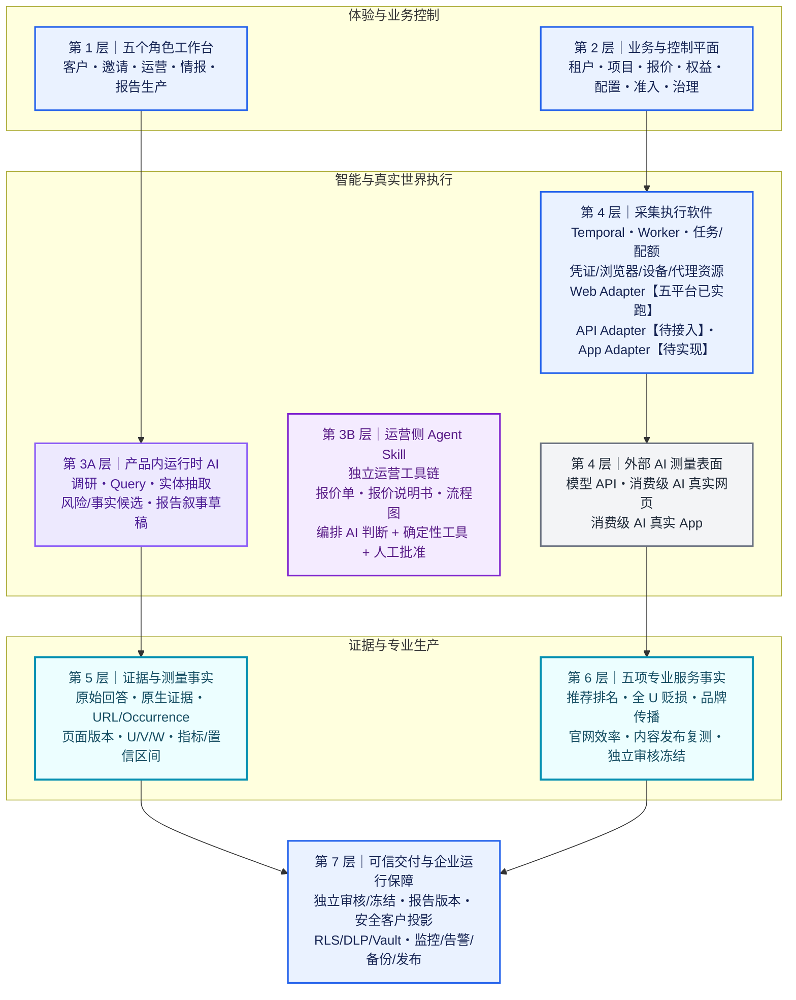

讲解重点：

1. Agent Skill 是独立调用的运营工具链，负责报价单、报价说明书和流程图等完整制品；人工批准后形成正式商业或流程资料。
2. 产品内运行时 AI 负责品牌调研、问题变体、实体抽取、风险/事实候选和报告草稿。
3. 确定性软件负责权限、定价、任务、采集控制、指标、版本和渲染；Web Adapter 已在五个平台实跑，API Adapter 待接入，App Adapter 待实现。
4. 五项服务分别审核并冻结自己的事实，报告系统随后生成正式交付版本。

---

## 核心图三｜客户视角：客户结果背后的系统（对应 02 #12）

客户通过一个统一工作区查看五项服务结果、案例、证据和报告。下方系统完成采集、取证、分析、审核、版本管理和运行保障。

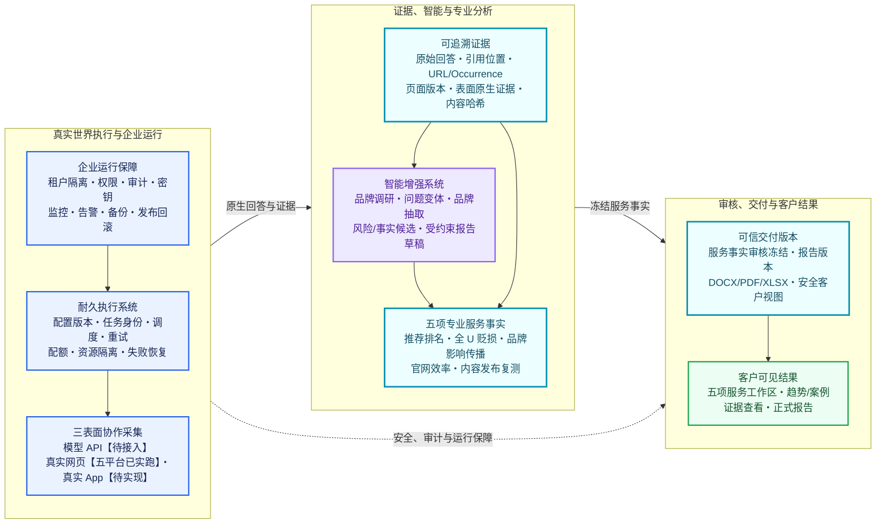

讲解重点：

1. 客户看到简洁结果，系统保留每个结果的测量条件和证据来源。
2. 五项服务共享原始事实，并分别采用自己的定义、审核过程和冻结版本。
3. 智能增强系统提供语义处理能力，确定性软件提供稳定计算与版本管理。
4. 企业运行保障覆盖数据隔离、审计、监控、备份和发布回滚。

---

# 分模块说明

## A. 界面、身份与项目

### 01｜五个角色工作台【已上线】

<code>customer-web</code> 向客户展示项目、五项服务、回答、证据和报告。<code>intake-form</code> 收集品牌、产品和材料。<code>operations-web</code> 承载运营控制。<code>intelligence-web</code> 承载信源研究。<code>report-studio</code> 承载报告审核与发布。当前应用直接复用 <code>api-client</code>、<code>auth</code>、<code>design-system</code>、<code>charts</code>、<code>evidence-viewer</code> 和 <code>workflow-ui</code>；<code>domain-types</code> 包已经存在，静态盘点未发现当前直接消费关系。

### 02｜身份、租户与安全【已形成】

边缘入口执行 TLS、限流和身份头清洗。API 执行会话、角色、能力、租户和项目范围校验。PostgreSQL Row-Level Security（行级安全策略）执行数据库级租户隔离。安全投影、DLP、Vault 和审计分别处理字段暴露、敏感数据、密钥和操作记录。

### 03｜客户事实、项目与配置【基础已上线，统一配置目标持续建设】

客户填写或确认品牌、产品、材料、目标和授权范围。品牌公开调研 AI 生成结构化预填候选，客户或运营确认后形成项目事实版本。统一配置模型包含 Query、产品、<code>collection_surface</code>、产品变体、模式、31 个省级地域、每格重复次数、频率、时间窗、交付物和 SLA。

## B. 商业能力与执行控制

### 04｜报价与 Agent Skill【部分可用】

<code>geo-quotation</code> Agent Skill 生成报价单和报价说明书。<code>workflow-diagram</code> Agent Skill 生成流程图。Agent 负责理解资料和组织内容；价格规则、模板校验和文件渲染由确定性工具执行；运营人员批准事实、金额、服务范围和对外版本。报价生产模板当前等待 V2 批准。

### 05｜准入、任务与耐久编排【基础已形成，V2 分阶段接入】

执行准入同时检查报价、权益、配置和目标能力。显式 <code>collection_targets</code> 选择需要测量的产品与采集表面。系统按稳定顺序物化 campaign、target、sampling leg 和 primary slot，并使用 sample ordinal 形成稳定样本身份。Temporal、Scheduler、Outbox、typed grant、原子配额、lease 和 fencing 共同控制长任务与共享资源。

## C. 三表面采集、证据与分析

### 06｜三表面协作采集【Web 有基础，API/App 为目标】

<code>provider_api</code> 定义模型提供方 API 采集路径，Adapter 待接入。<code>consumer_web</code> 通过真实浏览器采集五个消费级 AI 网页，已经完成实现和历史实跑验收。<code>consumer_app</code> 定义真实设备与 App 会话采集路径，Adapter 待实现。每个表面拥有独立 sampling leg、业务键、任务、事实和分母。系统按请求表面执行；资源不可用时记录 blocker 并停止该 sampling leg。

### 07｜证据与 U/V/W 信源模型【部分可用】

U 表示 AI 回答中发现的引用。每次引用保留独立 Occurrence。V 表示该引用页面在本次获取中的可观察状态。W 表示页面正文对 AI 回答的内容贡献证据。当前 W 使用 <code>content-contribution-exact-v1</code> 严格文本匹配。URL 规范化、页面版本、截图、网络材料和内容哈希共同形成可追溯证据。

### 08｜AI 应用与并行分析【已有实现基础】

<code>answer.capture.completed</code> 表示指定采集表面的捕获事实已经保存。随后并行运行品牌/实体抽取、URL 与页面处理、风险/事实/关系候选、当前 W 计算和 ClickHouse 投影。运行时 AI 负责语义候选。确定性规则负责归一化、严格匹配、Schema、证据定位、阈值、统计和版本。

## D. 五项专业服务

### 09｜Service 1：推荐与排名【基础最成熟】

系统在冻结测量矩阵上采集回答。运行时 AI 抽取品牌候选。确定性规则完成品牌归一化、严格匹配和位置识别。指标包括提及率、95% 置信区间、平均/最佳名次、Top1/3/5、可见度、竞品对照和重复一致性。分析人员复核分母、抽取和代表案例后冻结服务事实。

### 10｜Service 2：全 U 主动贬损审计【新定义已冻结，工程重建中】

服务覆盖项目时间窗内可观察的全部 U Occurrence。相同 URL 可以复用页面快照，每次引用上下文保持独立。运行时 AI 提取说话者、目标对象和行为候选。数据模型分别记录负面表达、事实真实性和内容归属。分析人员逐案复核精确页面版本与引文。

### 11｜Service 3：品牌受影响与传播【现有基础可用，目标设计持续建设】

服务从品牌中心的匹配问题组出发，连接 AI 回答、U Occurrence 和页面版本三层证据。通道 A 使用实际被引用的 U。通道 B 使用客户授权的引用池外候选页面。A 陈述账本记录 AI 实际表达，B 曝光账本记录外部内容的传播机会。两类账本分别统计和审核。

### 12｜Service 4：官网 U/V/W 效率【部分可用】

服务把官网内容进入 AI 回答的过程分为 U 发现、V 可观察、W 正文采用和最终引用。文本采用比较先移除回答的参考文献区。20 个及以上规范化字符构成保守直接采用证据，10—19 个字符列为弱证据。U、可观察 V、W 和最终引用分别使用自己的分母。

### 13｜Service 5：内容发布与同条件复测【有限试点】

服务先冻结干预前的测量矩阵和获批内容版本。发布系统分别记录提交、审核、发布、公开访问和可检索状态。发布时间位于前测与后测窗口之间时，系统使用相同问题、产品、地区、模式和重复条件复测。报告输出描述性变化；因果判断需要独立实验设计。媒体目录约 120,841 行，一个供应商协议已经验证。

## E. 交付、数据与运行保障

### 14｜报告与客户交付【内部审核阶段】

五项服务分别审核并冻结事实。报告 AI 只读取冻结事实并生成叙事草稿。审核人员批准事实、措辞和版本。系统随后创建不可变报告版本，并确定性渲染 DOCX、PDF、XLSX 和证据包。安全客户投影过滤内部字段并控制下载权限。

### 15｜数据与事件一致性【已形成】

PostgreSQL 保存权威业务事实。MinIO/S3/CAS 保存不可变证据对象。ClickHouse 保存可由权威事实重建的分析投影。Redis 保存缓存、限流和短期协调状态。Temporal PostgreSQL 保存 Workflow 历史。Vault 保存密钥和敏感状态。Transactional Outbox 在业务事务中同步创建待投递事件。

### 16｜运行保障、SOP 与发布【已形成】

OpenTelemetry 收集链路数据。Prometheus、Loki、Alloy 和 Grafana 提供指标、日志和可视化。Alertmanager 触发告警。SOP 规定暂停、恢复、人工接管、校准和故障处理步骤。全量/增量备份、恢复演练、迁移预检、自动化测试、五前端原子发布和版本回滚共同支撑生产运行。

---

## 实现成熟度摘要

| 能力                             | 实现成熟度                     |
| -------------------------------- | ------------------------------ |
| 五个角色工作台                   | 【已上线】                     |
| 身份、租户、安全、数据与运行保障 | 【已形成】                     |
| consumer_web 五平台真实网页采集  | 【已实现并实跑】               |
| provider_api 模型 API 采集       | 【待接入】                     |
| consumer_app 真实 App 采集       | 【待实现】                     |
| Scheduler 与 Collection Worker   | 【已实现；真实网页采集已实跑】 |
| UVW 基础结构与视图               | 【部分完成】                   |
| Service 1                        | 【基础可用】                   |
| Service 2 新定义                 | 【重建中】                     |
| Service 3 新目标设计             | 【部分建设】                   |
| Service 4                        | 【部分可用】                   |
| Service 5                        | 【有限试点】                   |
| 正式报告生产链                   | 【内部审核阶段】               |
| 报价 Agent Skill                 | 【生产模板待批准】             |

## 资料来源

- [GEO 系统三种视角总说明](../../../developlog/system-pipeline/02-complete-geo-system-three-perspectives.md)
- [GEO 系统逐模块图谱](../../../developlog/system-pipeline/03-geo-system-module-atlas.md)
- [2026-08-24 GEO 系统客户架构审计](../../../developlog/implementation/GEO_SYSTEM_CLIENT_ARCHITECTURE_20260824.md)
- [三表面采集契约与 Collectors 冻结设计](../../../developlog/requirements/20260824-multi-session-optimization-prompts/03-three-surface-collection-contract-and-collectors.md)
